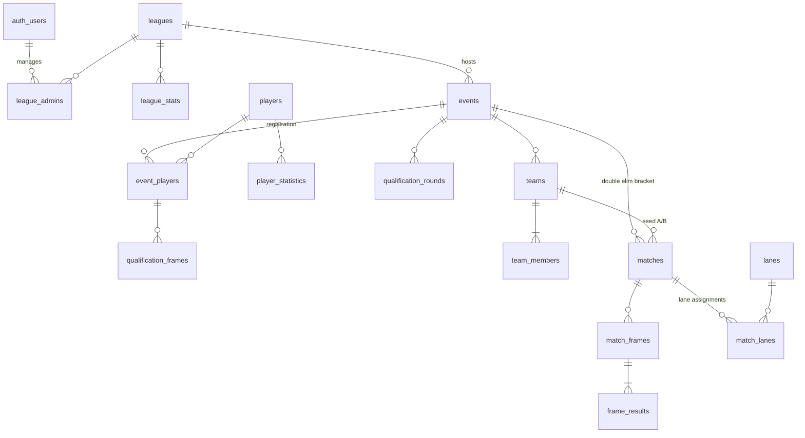

# Supabase Schema Proposal for Disc Golf Putting League

## 1. Entity-Relationship Overview

## 2. Table Specifications

### 2.1 `auth.users`
- **Purpose**: League administrators’ accounts.
- **Columns**: Provided by Supabase Auth.
- **Use**: Primary key referenced by `league_admins`.

### 2.2 `leagues`
| Column | Type | Constraints / Default |
|--------|------|------------------------|
| id | uuid | PK, gen_random_uuid() |
| name | text | NOT NULL |
| city | text | NULL allowed |
| created_at | timestamptz | NOT NULL, default now() |

- Unique index: (name, city)

### 2.3 `league_admins`
| Column | Type | Constraints |
|--------|------|-------------|
| id | uuid | PK |
| league_id | uuid | FK → leagues.id ON DELETE CASCADE |
| user_id | uuid | FK → auth.users.id ON DELETE CASCADE |
| role | text | enum ['owner','admin','scorer'], default 'admin' |
| created_at | timestamptz | default now() |

- Unique: (league_id, user_id)

### 2.4 `players`
| Column | Type | Constraints |
|--------|------|-------------|
| id | uuid | PK |
| full_name | text | NOT NULL |
| nickname | text | NULL |
| email | text | NULL |
| created_at | timestamptz | default now() |
| default_pool | text | optional |

- Index on full_name

### 2.5 `events`
| Column | Type | Constraints |
|--------|------|-------------|
| id | uuid | PK |
| league_id | uuid | FK → leagues.id |
| event_date | date | NOT NULL |
| location | text | defaults to league city |
| lane_count | integer | NOT NULL |
| putt_distance_ft | numeric(5,2) | NOT NULL |
| access_code | text | UNIQUE, not null |
| bonus_point_enabled | boolean | default TRUE |
| status | text | enum ['registration','qualification','bracket','completed'] |
| created_at | timestamptz | default now() |

### 2.6 `event_players`
| Column | Type | Constraints |
|--------|------|-------------|
| id | uuid | PK |
| event_id | uuid | FK → events.id ON DELETE CASCADE |
| player_id | uuid | FK → players.id |
| registration_status | text | enum ['registered','paid','withdrawn'], default 'registered' |
| pool | text | enum ['A','B'] |
| qualification_seed | integer | derived |
| paid_amount | numeric(8,2) | optional |
| created_at | timestamptz | default now() |

- Unique: (event_id, player_id)

### 2.7 `qualification_rounds`
| Column | Type | Constraints |
|--------|------|-------------|
| id | uuid | PK |
| event_id | uuid | FK → events.id |
| frame_count | integer | default 5 |
| created_by | uuid | FK → auth.users.id |
| status | text | enum ['not_started','in_progress','completed'] |
| created_at | timestamptz | default now() |

### 2.8 `qualification_frames`
| Column | Type | Constraints |
|--------|------|-------------|
| id | uuid | PK |
| qualification_round_id | uuid | FK → qualification_rounds.id |
| event_player_id | uuid | FK → event_players.id |
| frame_number | integer | 1..5 |
| putts_made | integer | 0..3 |
| points_earned | integer | 0..4 |
| recorded_by | uuid | FK → auth.users.id |
| recorded_at | timestamptz | default now() |

- Unique: (event_player_id, frame_number)

### 2.9 `teams`
| Column | Type | Constraints |
|--------|------|-------------|
| id | uuid | PK |
| event_id | uuid | FK → events.id |
| seed | integer | derived |
| pool_combo | text | e.g., 'A+B' |
| created_at | timestamptz | default now() |

### 2.10 `team_members`
| Column | Type | Constraints |
|--------|------|-------------|
| team_id | uuid | FK → teams.id ON DELETE CASCADE |
| event_player_id | uuid | FK → event_players.id |
| role | text | enum ['A_pool','B_pool','alternate'] |
| joined_at | timestamptz | default now() |

- PK: (team_id, event_player_id)

### 2.11 `matches`
| Column | Type | Constraints |
|--------|------|-------------|
| id | uuid | PK |
| event_id | uuid | FK → events.id |
| round_name | text | e.g., 'Winners R1' |
| match_order | integer | determines bracket order |
| team_one_id | uuid | FK → teams.id |
| team_two_id | uuid | FK → teams.id |
| winner_team_id | uuid | FK → teams.id |
| status | text | enum ['pending','ready','in_progress','completed'] |
| lane_id | uuid | FK → lanes.id |
| scheduled_at | timestamptz | optional |
| completed_at | timestamptz | optional |

### 2.12 `lanes`
| Column | Type | Constraints |
|--------|------|-------------|
| id | uuid | PK |
| event_id | uuid | FK → events.id |
| label | text | e.g., 'Lane 1' |
| current_match_id | uuid | FK → matches.id |
| status | text | enum ['idle','occupied','maintenance'], default 'idle' |

- Unique: (event_id, label)

### 2.13 `match_lanes`
| Column | Type | Constraints |
|--------|------|-------------|
| id | uuid | PK |
| match_id | uuid | FK → matches.id |
| lane_id | uuid | FK → lanes.id |
| assigned_at | timestamptz | default now() |
| released_at | timestamptz | nullable |

### 2.14 `match_frames`
| Column | Type | Constraints |
|--------|------|-------------|
| id | uuid | PK |
| match_id | uuid | FK → matches.id |
| frame_number | integer | 1..N |
| is_overtime | boolean | default FALSE |
| created_at | timestamptz | default now() |

- Unique: (match_id, frame_number)

### 2.15 `frame_results`
| Column | Type | Constraints |
|--------|------|-------------|
| id | uuid | PK |
| match_frame_id | uuid | FK → match_frames.id |
| event_player_id | uuid | FK → event_players.id |
| putts_made | integer | 0..3 |
| points_earned | integer | 0..4 |
| order_in_frame | smallint | 1 or 2 |
| recorded_at | timestamptz | default now() |

- Unique: (match_frame_id, event_player_id)

### 2.16 `player_statistics`
| Column | Type | Constraints |
|--------|------|-------------|
| id | uuid | PK |
| player_id | uuid | FK → players.id |
| league_id | uuid | FK → leagues.id |
| event_id | uuid | FK → events.id, nullable |
| stat_type | text | e.g., 'qualification_avg' |
| value | numeric | aggregated |
| computed_at | timestamptz | default now() |

- Unique: (player_id, event_id, stat_type)

### 2.17 `league_stats`
| Column | Type | Constraints |
|--------|------|-------------|
| id | uuid | PK |
| league_id | uuid | FK → leagues.id |
| stat_type | text | e.g., 'avg_putts_per_frame' |
| value | numeric | aggregated |
| computed_at | timestamptz | default now() |

## 3. Modeling Key Requirements

### 3.1 Multiple Admins per League
Handled by `league_admins` join table (league ↔ auth.users) with role column.

### 3.2 Player Participation Across Events
`event_players` links players to events, tracks registration, pool, seeding, payments.

### 3.3 Qualification & Bracket Play
- Qualifications: `qualification_rounds`, `qualification_frames` capture per-frame scores.
- Pools/seeds stored in `event_players`.
- Teams built via `teams` + `team_members`.
- Bracket + matches via `matches`, `match_frames`, `frame_results` with overtime support.

### 3.4 Lane Assignments & Live Scoring
- `lanes` define availability; `match_lanes` (or `matches.lane_id`) allocate lanes.
- `matches.status` controls concurrency; `frame_results` store live per-player scoring.

### 3.5 Player Statistics
- Raw data from `qualification_frames` + `frame_results`.
- Aggregations stored in `player_statistics` (per event and cumulative) and `league_stats`.

## 4. Supabase Considerations

### RLS Policies
- Restrict `leagues`, `events`, `event_players`, etc. to authenticated admins via membership in `league_admins`.
- Public scoring via RPC or edge functions verifying `access_code` before allowing inserts/selects.

### JSON vs Relational
- Core entities are relational for integrity.
- Optional JSONB fields: `events.settings`, `matches.bracket_meta` for rarely changing structured data.

### Automation & Performance
- Triggers/functions to auto-create lanes, recompute seeds, and refresh stats.
- Index frequently filtered columns (event_id, status, lane_id).
- Consider materialized views for leaderboards.
